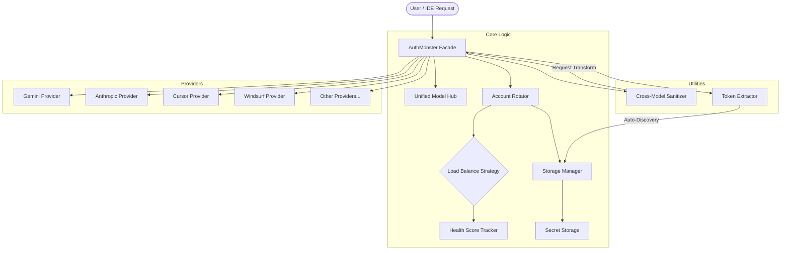

# System Knowledge Graph

**Version:** 1.0.0
**Last Updated:** 2023-10-27
**Status:** Active Analysis

## 1. High-Level Architecture

## 2. Entity-Relationship Model

### ManagedAccount
- **ID**: Unique identifier (UUID or generated)
- **Provider**: Enum (Gemini, Anthropic, Cursor, etc.)
- **Tokens**: `OAuthTokens` (Access, Refresh, Expiry)
- **API Key**: Optional string
- **Health**: `isHealthy`, `healthScore`, `consecutiveFailures`
- **Quota**: `limit`, `remaining`, `resetTime`
- **Usage**: `totalInputTokens`, `totalOutputTokens`, `totalCost`

### AuthDetails
- **Provider**: `AuthProvider`
- **Account**: `ManagedAccount`
- **Headers**: Record<string, string> (e.g., Authorization, User-Agent)
- **ModelInProvider**: String (e.g., 'claude-3-opus-20240229')

### AuthMonsterConfig
- **Active**: Default active provider
- **Fallback**: Array of fallback providers
- **Method**: Rotation strategy (`sticky`, `round-robin`, `hybrid`, `quota-optimized`)
- **Thinking**: Logic for reasoning models
- **Quota**: Quota management settings

## 3. Component Registry

| Component | File Path | Responsibility | Dependencies |
| :--- | :--- | :--- | :--- |
| **AuthMonster** | `src/index.ts` | Main facade, initializes core components, handles request flow. | Storage, Rotator, Hub, Providers |
| **CLI** | `src/cli.ts` | Command-line interface for management and testing. | AuthMonster, Commander |
| **UnifiedModelHub** | `src/core/hub.ts` | Routes generic model names to specific provider/model pairs. | AccountRotator, Types |
| **AccountRotator** | `src/core/rotation.ts` | Selects accounts based on strategy and health. | HealthScoreTracker, QuotaManager |
| **StorageManager** | `src/core/storage.ts` | Persists account data to JSON, handles locking. | SecretStorage, proper-lockfile |
| **SecretStorage** | `src/core/secret-storage.ts` | Encrypts secrets or uses OS Keychain. | child_process (security), crypto |
| **TokenExtractor** | `src/utils/extractor.ts` | Auto-discovers tokens from local environment. | child_process, fs, sqlite3 |
| **Sanitizer** | `src/utils/sanitizer.ts` | Cleans requests to prevent cross-model conflicts. | - |
| **Providers** | `src/providers/*/index.ts` | Adapters for specific AI providers. | Proxy, Types |

## 4. Operational Constraints & Rules

1.  **Rotation Logic:**
    *   **Sticky:** Pins to one account until limit/failure.
    *   **Round-Robin:** Cycles through healthy accounts.
    *   **Hybrid:** Uses Health Score + Usage Metrics.
    *   **PID Offset:** Initializes cursor based on `process.pid` to avoid collision in parallel instances.

2.  **Rate Limiting:**
    *   **Dedup:** Ignores concurrent 429 errors within a 2-second window.
    *   **Backoff:** Exponential backoff for quota exhaustion, fixed backoff for other errors.

3.  **Security:**
    *   **Secrets:** Stored in OS Keychain (macOS) or encrypted file (Linux/Windows).
    *   **Key Derivation:** Uses machine-specific data (MAC/Hostname) for file encryption key. *Security Warning: This is obfuscation, not strong encryption against local root.*

4.  **Platform Support:**
    *   **MacOS:** Full support (Keychain, Cursor/Windsurf paths).
    *   **Linux/Windows:** Limited auto-discovery (File-based secrets).

5.  **Technical Debt:**
    *   `TokenExtractor` uses `execSync` which blocks the event loop.
    *   `OpenAI` and `Copilot` providers are defined in types but missing implementation in `src/index.ts`.
